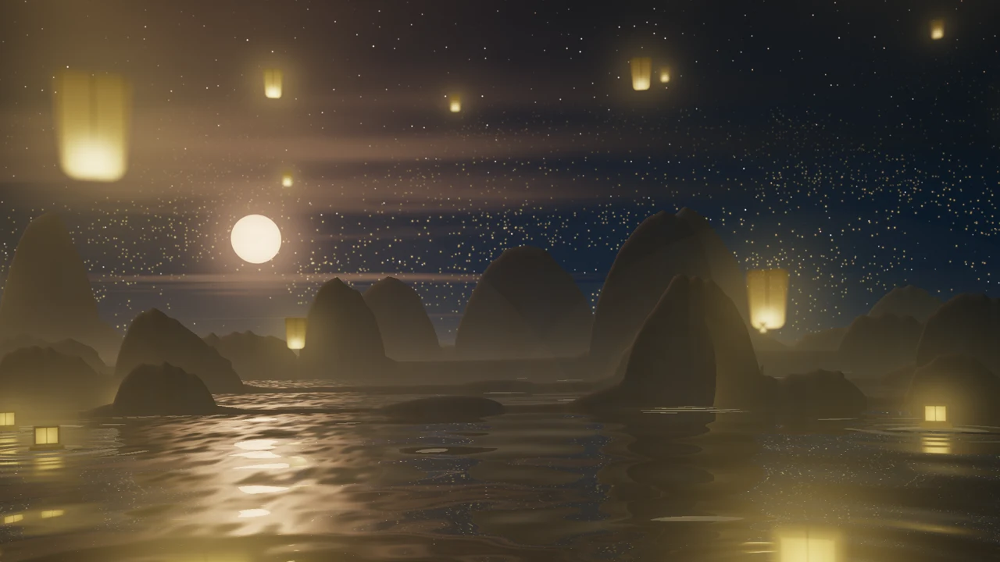

# Lantern Tide — a night of wishes on a karst lake



[Watch it move with music](../assets/lantern_tide_motion.webp)

A still mountain lake under a low moon. Paper sky lanterns lift off the water
and drift up between misty limestone towers, and small floating lanterns ride
the swell in the foreground. Beyond the ranges, whole villages launch theirs:
clusters of far points climbing into the stars.

Every lantern is tied to its own slice of the spectrum. A chord lights a
constellation of them, and a melody moves across the sky. The shader draws no
bars or meters. The music shows up only as the lanterns' fire and the water's
motion.

## Music

| Input | Response |
| --- | --- |
| Individual bands | Each sky lantern, floating lantern, and far swarm point flares with its own band (`0.35 + 3.4·b^2.2`), so loud bands flare hard and quiet ones stay embers |
| Bass | Lake swell amplitude, ripple rings around the floating lanterns, boat bob, and a gentle exposure breath |
| Mids | Density and warmth of the valley mist, lit from below by the lanterns |
| Treble | Star twinkle, flame flicker, and glitter along the moon path |
| Silence | The scene keeps moving: lanterns rise at an idle glow, and the camera keeps its slow drift and rocking |

Audio magnitudes are compressed as `f / (0.65 + f)`. Audio changes amplitudes
and brightness only. It never changes the rate of time, so motion has no phase
jumps when the level changes.

## Palette

| Slot | Role |
| --- | --- |
| `color1` | Night sky and deep water |
| `color2` | Limestone and valley mist |
| `color3` | Moonlight and lantern paper |
| `color4` | Lantern fire, light pools, and the far swarm |

Palette colors are linearized and rescaled to a target luminance before use.
Any `colors.toml` therefore still reads as night. A bright yellow `color1`
becomes a dark olive sky, and a teal `color4` gives teal lanterns.

## Rendering

The render uses no marching loop. Each part is solved analytically:

- **Karst ranges** are five vertical height-profile planes at geometric
  distances. A ray intersects each plane once. Profiles are procedural tower
  stacks with a lean, a dome, and a talus skirt. The nearer ranges frame the
  view and leave the centre open for the moon.
- **The lake** is a gradient-only wave field: six dispersive swells plus
  ripple rings from every floating lantern. High-frequency detail fades with
  distance to avoid aliasing.
- **Lanterns** are ray/billboard intersections in world space. The same
  function draws them for the camera ray and for the reflected ray. As a
  result, reflections are geometrically correct, sit under their lanterns, and
  ripple with the water. The waterline clips floating lanterns.
- **Depth of field** uses a thin-lens circle of confusion, and pixel-footprint
  softening keeps distant lanterns and stars at one or two pixels without
  shimmer.
- **Height fog** is integrated analytically along each ray.
- A filmic curve, vignette, and grain keep the dark gradients free of banding.

Measured at 1920×1080: about 3.5 ms/frame on an RTX 3090 and about 48 ms/frame
at 1280×720 on a Ryzen 7800X3D iGPU.

## Open it

`lantern_tide` appears in the native shader cycle and the web picker. A
running web preview can open it with `#lantern_tide`, or use:

```sh
utils/vibe-web-window.sh lantern_tide
```

For a native installation, copy `lantern_tide.wgsl` into the shader directory
used by your launcher. The XDG-aware `vibe-window` launcher checks
`~/.local/share/vibe/shaders/` first.
