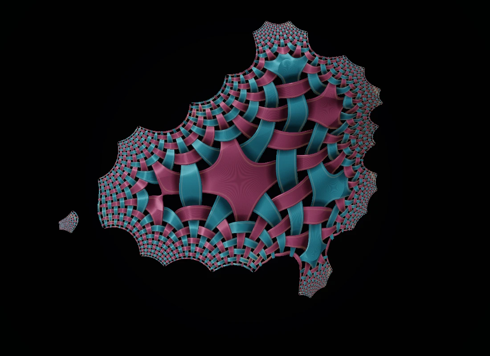

# Prismatic Loom — quadratic metamorphosis



[Watch the geometric transformation study](../assets/prismatic_loom_motion.webp)
— an accelerated, eased out-and-back traversal of the ambient motion. The actual
shader moves slowly; music adds local changes to that motion.

The weave itself passes through a Mandelbrot-derived geometric transformation.
Ribbons curve around critical points, openings stretch into branching passages,
and the perimeter develops cusps and satellite lobes. Warp and weft retain their
own silk colors throughout. Their over/under crossings, thickness, silhouettes,
and directional highlights all belong to the transformed three-dimensional
surface.

## The geometric map

The shader evaluates a finite quadratic orbit at each surface query:

```text
c = 0.64 × (x + iy) − 0.55
P₀(c) = 0
Pₙ₊₁(c) = Pₙ(c)² + c

n = floor(depth)
h = smoothstep(0, 1, fract(depth))
w = 1.7 × exp(i × angle) × ((1 − h) × Pₙ(c) + h × Pₙ₊₁(c) − slice)
```

`w` supplies the coordinates in which the source loom's ribbon cross sections,
crossings, and rounded perimeter are defined. Rendering their **preimage** makes
the actual geometry bend and branch. A ray through a transformed opening misses
the textile entirely.

The orbit's complex derivative rescales the approximate distance field and
provides the direction of the curved silk fibers. Finite iterates reveal the
Mandelbrot family's lobes and critical structure. Interpolation between adjacent
iterates gives continuous geometric motion, with zero interpolation slope at
integer depths. This is a finite polynomial deformation, rather than a mesh of
the exact infinite Mandelbrot set.

## Motion and interaction

The ambient route traverses recursion depth, the real and imaginary source
slice, the orientation of that slice, and physical torsion. It moves between
broad flowing weaves and dense branching forms. The camera gently compensates
for the specimen shrinking at deeper recursion.

| Input | Geometric or material response |
| --- | --- |
| Bass | Changes recursion depth and cloth breathing |
| Mids | Shift the real/imaginary slice and increase physical torsion |
| Individual frequency bands | Modulate the slice balance and individual ribbon edges |
| Treble | Strengthens directional silk highlights and metallic selvedges |
| Mouse X/Y | Steer the real/imaginary slice and adjust the viewpoint |
| Click | Plucks the surface and briefly perturbs recursion depth |
| Silence | Continues the complete ambient geometric route |

Audio magnitudes are compressed as `max(f, 0) / (0.65 + max(f, 0))`. Audio adds
bounded offsets to the route; it does not multiply elapsed time, which would
cause phase jumps when the level changes. Recursion is bounded to 1–5, using at
most six quadratic updates per query.

The four palette colors remain separated by material: **color1** lights the
studio, **color2** colors the weft, **color3** colors the warp, and **color4**
colors metallic edges. The preview uses a rose/cyan/gold palette; your configured
palette determines the actual colors.

## Open it

Select `prismatic_loom` in the native shader cycle or web picker. A running web
preview can open it directly with `#prismatic_loom`, or use:

```sh
utils/vibe-web-window.sh prismatic_loom
```

For a native installation, copy `prismatic_loom.wgsl` into the shader directory
used by your launcher. The XDG-aware `vibe-window` launcher checks
`~/.local/share/vibe/shaders/` first; the repository's `utils/cycle-shader.sh`
uses `${VIBE_CONFIG_DIR:-$HOME/.config/vibe}/shaders/`.

## Rendering and verification

The shader needs no textures or previous frames. A bounding sphere and a folded
slab skip empty space before complex iteration. It uses at most 128 primary ray
steps, with derivative-scaled ribbon relief and pixel-footprint filtering for
fine fibers. Critical-point length scales are regularized to keep the distance
estimate usable.

Verification includes native WGSL validation, GPU-to-CPU comparisons of the
polynomial map and its derivative, continuity across integer depths, and
comparison with a more conservative trace. Unlit silhouette renders with fixed
camera framing verify that bass and mids change the actual geometry. Additional
renders cover clicks, short/extreme audio buffers, alternate palettes, portrait
windows, and the ambient motion route.
